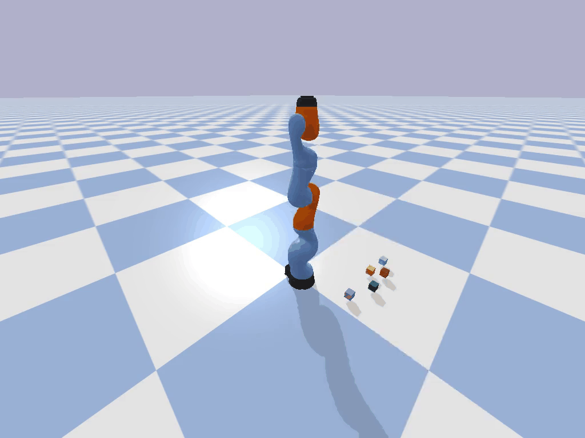
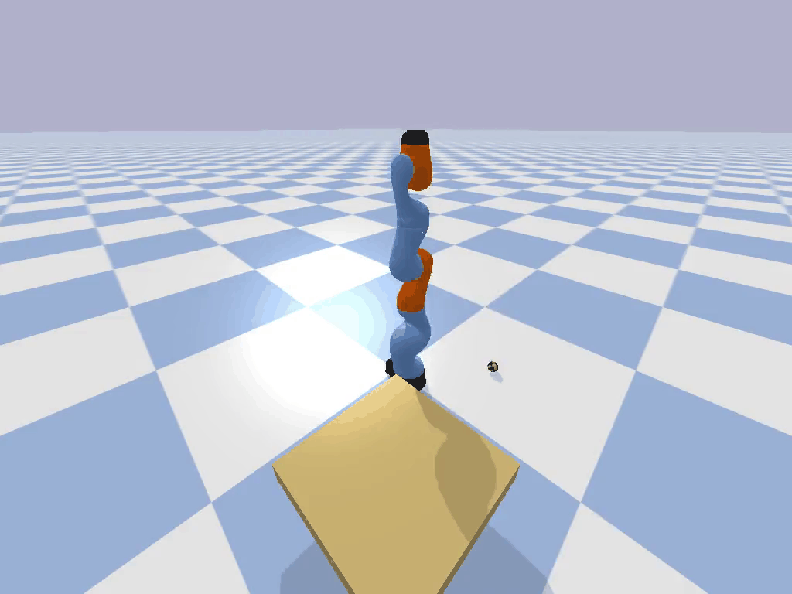
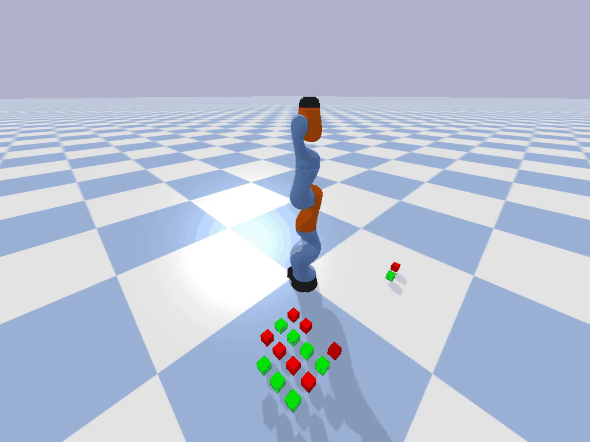

This repo uses a robotic gym enivornment to explore parent-child approaches to robotic learning. 
It is broken up into varipous parts, the parent model, the child model and the simulation itself.

## Simulation
The simulation uses pybullet, a 3D physics simulator made for python robotics integration. We make use of a default robot arm design and various 3D objects that are either in the deffault pybullet or the assets of this project. 

There are various tasks within the simulation such as building towers, organsing size/ colour etc... 

<table>
  <tr>
    <td align="center">
      <br>
      <b>Challenge 1</b>
    </td>
    <td align="center">
      <br>
      <b>Challenge 2</b>
    </td>
  </tr>
  <tr>
    <td align="center">
      <br>
      <b>Challenge 3</b>
    </td>
    <td align="center">
      <br>
      <b>Challenge 4</b>
    </td>
  </tr>
  <tr>
    <td align="center">
      <br>
      <b>Challenge 5</b>
    </td>
    <td align="center">
      <br>
      <b>Challenge 6</b>
    </td>
  </tr>
</table>

## Parent model 

## Child Model 


## Dependiencies 
We make use of the PyBullet robot arm m
```
pip install pybullet
```

